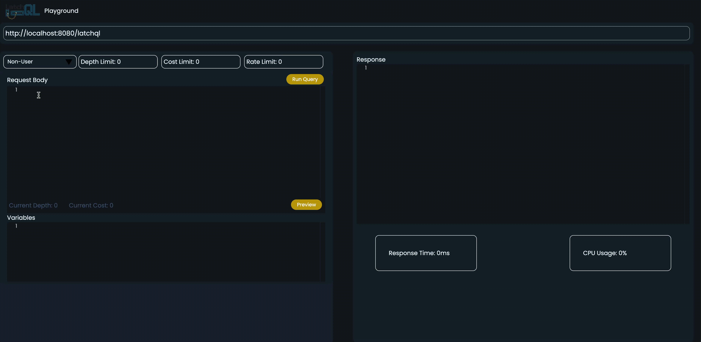

# LatchQL Playground

The LatchQL Playground is an optional, built-in playground for testing your GraphQL endpoint.

# Features

- Preview cost and depth of your current query before execution.
- Displays important metrics for tracking response time and CPU usage.
- Save variables to reference in the body of your GraphQL queries.

# Getting Started

1. Install LatchQL npm package.
2. Clone the playground.
3. Install its dependencies:

   ```npm install --force```

4. Build the playground:

   `npm run dev`

# How to use LatchQL Playground

1. Select the right permission level
   

2. Preview Cost/Depth of the current query
   
   
3. Depth Limiter
   

4. Cost Limiter
   

5. Rate Limiter
   

# Authors

Alex McPhail: [GitHub](https://github.com/mcphail-alex) ｜ [LinkedIn](https://www.linkedin.com/in/mcphail-alex/)  
Celine Leung: [GitHub](https://github.com/ccelineleung) ｜ [LinkedIn](https://www.linkedin.com/in/celineleung412/)  
Hannah Bernstein: [GitHub](https://github.com/hbernie) ｜ [LinkedIn](https://www.linkedin.com/in/bernstein-hannah/)  
Johnjered Tolentino: [GitHub](https://github.com/Johnjeredivant) | [LinkedIn](https://www.linkedin.com/in/johnjered-tolentino/)  
Raymond Kim: [GitHub](https://github.com/reykeem) | [LinkedIn](https://www.linkedin.com/in/raymondhkim/)

# How to Contribute

If you would like to contribute in improving the functionality of LatchQL, please submit your ideas and/or bug fixes to our team by forking the repo and submitting your changes via a pull request.

## Iteration Opportunities

1. Storing history GraphQL queries
2. Editing user's permission level on GUI
3. Calculating cost and depth of query mutations

## To Learn More

Visit the [LatchQL Website](https://github.com/reykeem)
Read the [LatchQL Medium article](https://github.com/reykeem)

### License

Distributed under the MIT License. See [LICENSE](https://github.com/oslabs-beta/LatchQL/blob/main/LICENSE.md) for more information.
